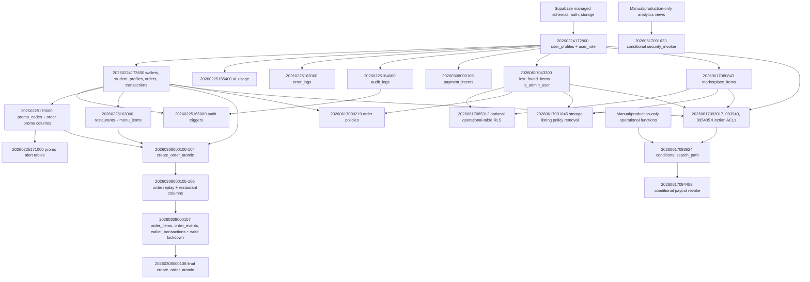

# Supabase migration health audit

Audit scope: every file under `supabase/migrations`, in timestamp order.

## Dependency graph

## Per-migration inventory

| Timestamp | Objects and actions | Dependencies and health |
|---|---|---|
| `20260224172800` | Drops/recreates `user_role`; creates `user_profiles`, role index, `handle_new_user()`, `get_user_role(uuid)`, auth trigger, owner profile policy; contains optional mock-user block | Requires managed `auth.users`. Root repository migration. Mock block catches missing `gen_salt`; authentication cleanup is outside this audit. |
| `20260224173600` | Drops/recreates order/transaction enums; creates `wallets`, `student_profiles`, `orders`, `transactions`; indexes; wallet/update trigger functions and six triggers; RLS policies; mock business data block | Requires `user_profiles`. All referenced repository objects exist in order. |
| `20260225155400` | Creates `ai_usage`, indexes, update function/trigger, owner RLS policy | Requires `user_profiles`. Healthy. |
| `20260225162000` | Creates `error_logs`, indexes, insert/read policies | Requires `user_profiles`. Healthy. |
| `20260225163000` | Creates `restaurants`, `menu_items`, indexes, update function/triggers, read policies; inserts catalog mock data | Self-contained after managed roles. Healthy. |
| `20260225164000` | Creates `audit_logs`, six indexes, insert/read/delete policies | Requires `user_profiles`. Healthy. |
| `20260225165000` | Creates `log_table_mutation()` and audit triggers on `student_profiles`, `orders`, `transactions` | Requires `audit_logs` and commerce tables. Healthy. |
| `20260225170000` | Creates `promo_codes`, indexes, two order columns, read policy, `validate_promo_code(text,numeric,text)` | Requires `orders`. Healthy. |
| `20260225171000` | Creates `promo_alert_thresholds`, `promo_alert_logs`, indexes, admin/service policies | Requires `promo_codes` and `user_profiles`. Healthy. |
| `20260308000100` | Adds checkout idempotency column/index; creates `create_order_atomic(uuid,uuid,text,jsonb,numeric,text,text)`; revokes/grants execute | Requires orders, wallets, promo and food tables. Function body references order/ledger tables created later; PostgreSQL permits deferred PL/pgSQL relation planning. |
| `20260308000101` | Revokes checkout RPC from `PUBLIC` | Requires exact checkout signature from `00100`. Healthy. |
| `20260308000102` | Revokes checkout RPC from `anon` | Requires exact checkout signature. Healthy. |
| `20260308000103` | Grants checkout RPC to `authenticated` | Requires exact checkout signature. Healthy. |
| `20260308000104` | Replaces checkout RPC with promo guard; same signature and parameter names | Requires exact `00100` function and prior tables. Compatible replacement. |
| `20260308000105` | Adds `orders.payment_id` and unique partial index | Requires `orders`. Healthy. |
| `20260308000106` | Adds restaurant/wallet order columns, conditional restaurant FK, index | Requires `orders` and `restaurants`. Healthy. |
| `20260308000107` | Replaces profile/signup behavior; locks client writes; creates `order_items`, `order_events`, `wallet_transactions`, indexes and select policies; adjusts promo-log policy | Requires profiles, orders, wallets, transactions, menu items and promo logs. Healthy. |
| `20260308000108` | Replaces checkout RPC with final payment-method restriction; same signature and parameter names; restores exact ACL | Requires tables created through `00107`. Compatible replacement. |
| `20260308000109` | Creates `payment_intents`, indexes, select policy and update trigger; write revokes | Requires `user_profiles` and `update_updated_at_column()`. Healthy. |
| `20260617043300` | Creates `lost_found_items`, indexes, `is_admin_user()`, update function/trigger, row policies, storage bucket and object policies | Requires managed auth/storage and `user_profiles`. Healthy on hosted Supabase. |
| `20260617080843` | Creates `marketplace_items`, indexes, update function/trigger, row policies, storage bucket and object policies | Requires managed auth/storage and `is_admin_user()`. Healthy. |
| `20260617085312` | Enables RLS and creates read/admin/rider policies for nine operational tables | **Repaired.** All nine tables are absent from repository history and app comments confirm external schema dependency. Each table is now conditionally hardened with explicit warnings. |
| `20260617090219` | Replaces order insert/update/delete policies | Requires mandatory `orders` and `is_admin_user()`. Healthy; failures remain explicit. |
| `20260617091045` | Drops two public storage-listing policies | Requires managed `storage.objects`; policies use `IF EXISTS`. Healthy. |
| `20260617091623` | Sets `security_invoker=true` on 25 analytics views | **Repaired.** No listed view is created in repository history. Each is checked with `to_regclass`; wrong relation kind fails explicitly. |
| `20260617093017` | Revokes direct execution of seven trigger/helper functions from `anon` and six from `authenticated` | All signatures are created earlier in repository history. Mandatory and healthy. |
| `20260617093624` | Sets fixed search paths on 18 function signatures | **Repaired.** Thirteen repository functions are mandatory and raise on absence; five external operational functions are conditional with warnings. |
| `20260617093949` | Revokes seven security-definer/helper functions from `PUBLIC`; grants promo validation to `authenticated` | All signatures are mandatory and created earlier. Healthy. |
| `20260617094458` | Revokes payout RPC from `authenticated` | **Repaired.** RPC is never created in repository history; conditional `to_regprocedure` check preserves the revoke when present. |
| `20260617095405` | Grants `is_admin_user()` to `authenticated` for RLS policy evaluation | Requires mandatory function from `043300`. Healthy. |

## Broken objects and repair classification

### Conditional: definitions absent from repository

- Tables: `delivery_hubs`, `delivery_points`, `delivery_zones`,
  `dispatch_queue`, `menu_categories`, `menu_item_variants`,
  `restaurant_settlements`, `rider_settlements`, `riders`.
- Views: all 25 analytics/settlement views named in migration `20260617091623`.
- Functions: `assign_rider_atomic(uuid)`, `batch_assign_orders(uuid)`,
  `generate_weekly_restaurant_settlement()`,
  `mark_rider_payout_paid(uuid,timestamptz,numeric)`,
  `retry_dispatch_ready_orders()`.

These are referenced by parts of the application or production-warning cleanup
migrations, but their schema definitions are unavailable. Creating them here
would invent business logic. Removing the hardening would weaken environments
where they exist. Conditional hardening is therefore the safe repair.

### Mandatory: definitions proven in repository order

- Core profiles, commerce, audit, promo, food-ordering, order-ledger,
  marketplace, lost/found and payment-intent tables.
- All foreign-key targets used by repository-created tables.
- `create_order_atomic(uuid,uuid,text,jsonb,numeric,text,text)`.
- `create_wallet_for_user()`, `get_user_role(uuid)`, `handle_new_user()`,
  `is_admin_user()`, `log_table_mutation()`,
  `set_lost_found_updated_at()`, `set_marketplace_updated_at()`,
  `update_ai_usage_updated_at()`, `update_food_ordering_updated_at()`,
  `update_updated_at_column()`, `update_wallet_balance()`,
  `validate_promo_code(text,numeric,text)`.

Mandatory-object failures are intentionally not ignored.

## Verification

- Clean hosted install: all 30 migrations applied in timestamp order with no
  manual SQL and no skipped migration.
- Upgrade: reset through `20260308000106`, inserted representative users,
  roles, wallet balance, order and transaction history, then applied every
  remaining migration successfully.
- Preservation after upgrade: roles unchanged, wallet balance `150.00`
  unchanged, one order retained, two transactions retained.
- Function verification: all 13 mandatory functions present with
  `search_path=public, extensions`.
- Policy verification: expected order, wallet, ledger, marketplace,
  lost/found and payment-intent policies present.
- Grant verification: expected restricted helper ACLs and application RPC
  grants present.

## Remaining risk

`20260224172800` contains an authentication mock-user block that catches and
logs a missing `gen_salt` function on a clean hosted project. It does not abort
the migration chain, but it is not production-safe seed behavior. Authentication
was explicitly excluded from this migration-health change and requires a
separate authorized repair.

`supabase db lint --linked --level warning` reports `42P01` inside
`create_order_atomic` for its session-local `tmp_checkout_items` table. The
function creates that temporary table immediately before using it, but the
static PL/pgSQL checker cannot resolve the runtime temporary relation. Checkout
business logic was explicitly excluded from this change, so the function was
not modified.
